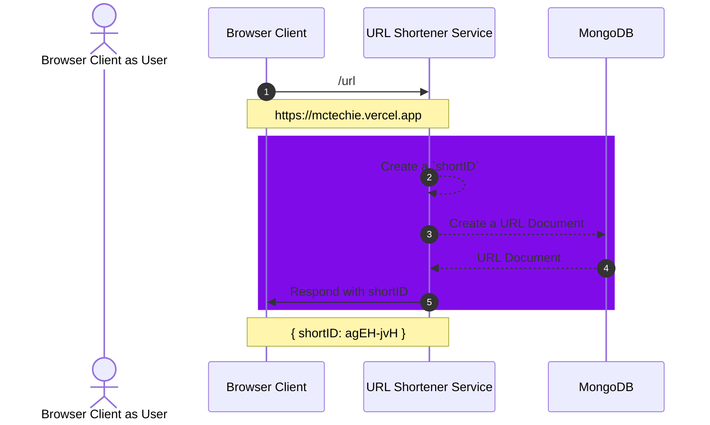
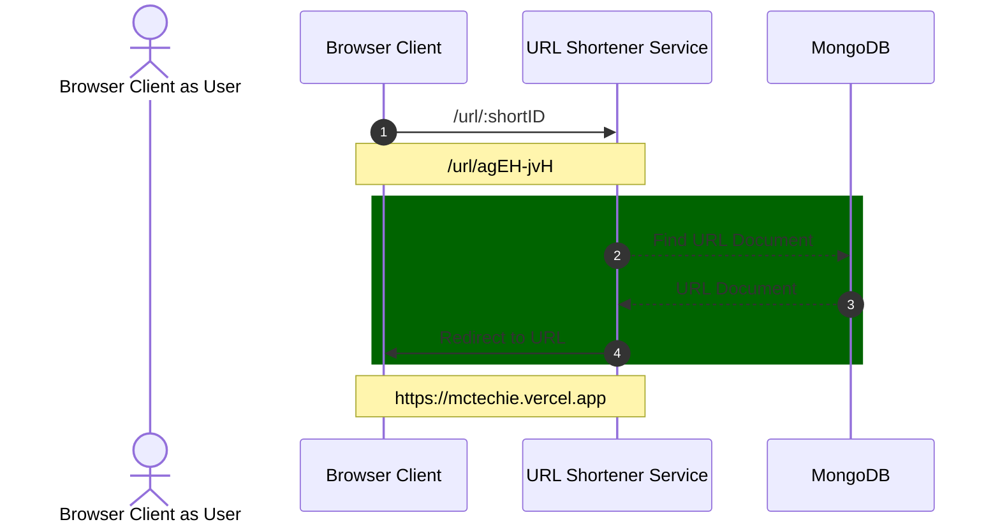
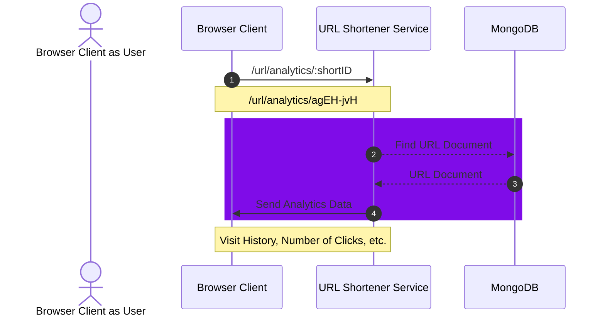
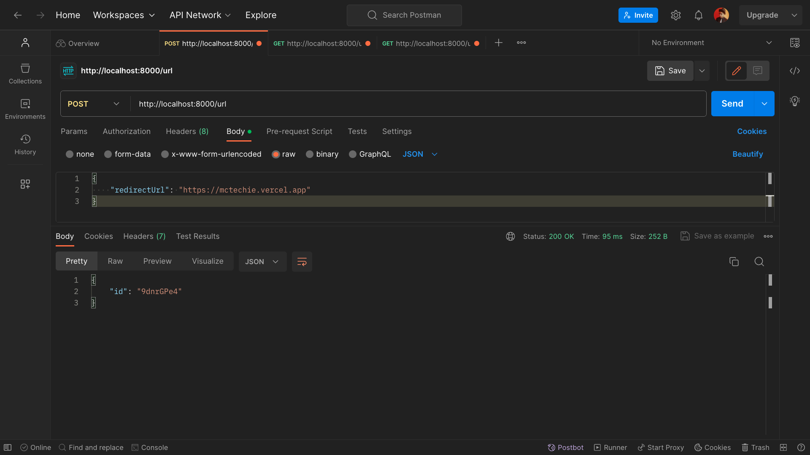
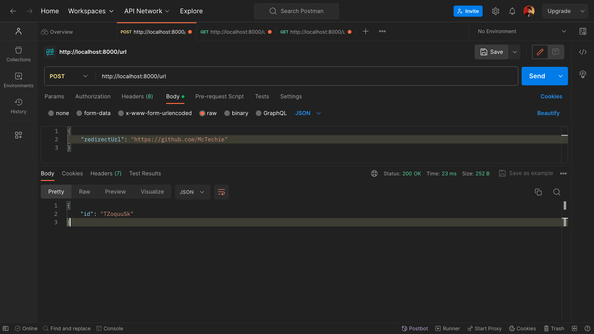
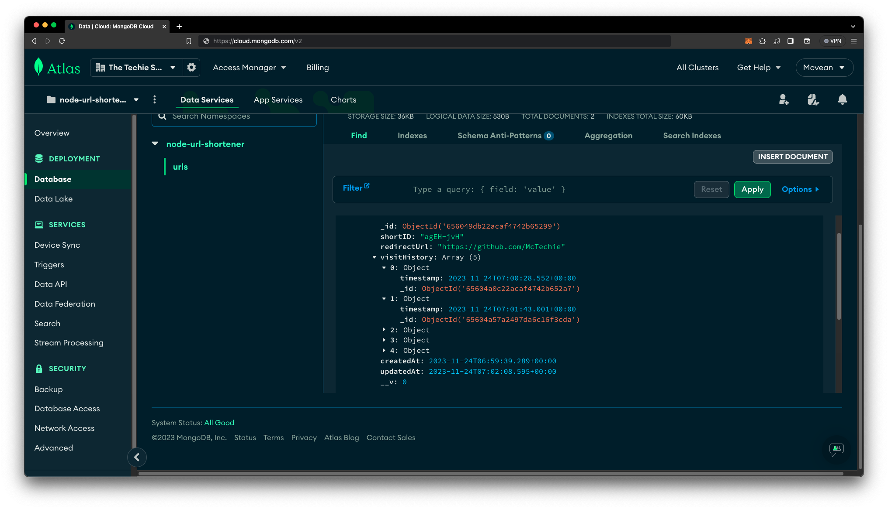
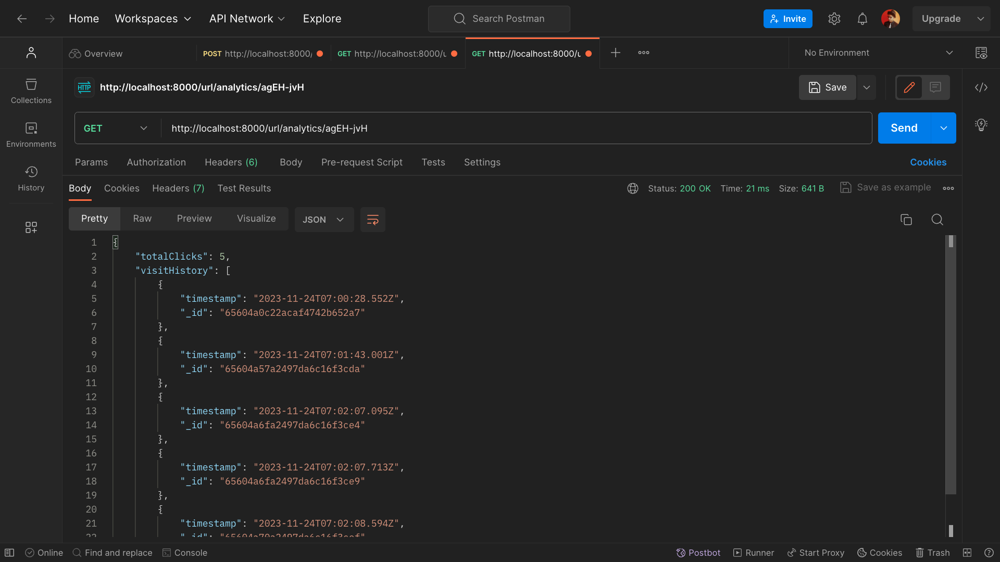

# URL Shortener Service (Node.js)

> This is a simple example of a URL shortener service created using Express.js, for the purpose of learning.

### Architecture

#### Generate Short URL



#### Redirect to Original URL



#### Analytics



### How to run

> This project requires Node.js to run.

```bash
# Clone the repository
git clone https://github.com/McTechie/node-url-shortener.git

# Change directory
cd node-url-shortener

# Install dependencies
npm install

# Run the server
npm start
```

### Demo

#### Client 1



#### Client 2



#### MongoDB



#### Analytics


